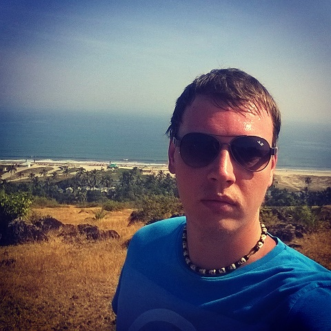

# Dzmitry Zhukouski



## Contacts

- Location: Minsk, Belarus
- Phone: +375 29 562-40-86
- Email: dimalimp1986@gmail.com
- Discord: dimalimp
- [GitHub](https://github.com/Dimalimp)
- [GitLab](https://gitlab.com/dimalimp)

## About Me

At this stage of my life, I set myself the task of becoming a professional front-end developer. I signed up for the Rooling-scopes school: “JavaScript Development " course to gain the necessary knowledge and skills. I am moving purposefully and rapidly in this direction.

## Current skills

- HTML5, CSS3
- Sass, SCSS
- Git, GitHub
- JavaScript Basics
- React.Js Basics
- Adobe Photoshop, Figma

## Code example

Reversed Strings

```
function solution(str){
    return str.split("").reverse().join("")
}
```

## Courses

- RS Schools Course «JavaScript/Front-end. Stage 0» (in progress)
- [Stormnet.Web Development (Layout) in HTML and CSS, JavaScript](https://www.it-courses.by/courses/kursy-web-dizajna-verstki-html-i-css/)

## Language

- Belarussian native
- Russian
- English - A1
